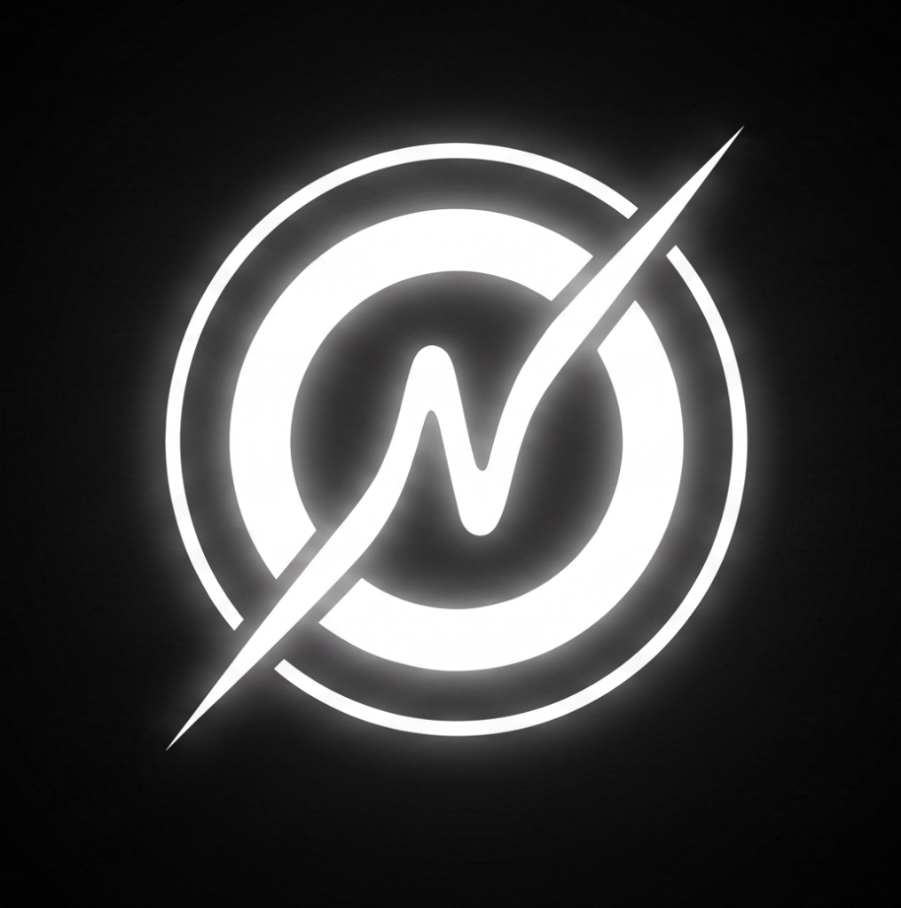

<div align="center">

  

  # ✦ A X I Ø T U N E ✦
  ### *The Next-Generation Audiophile Web Streaming Platform*

  <p align="center">
    <b>Apple Music "Liquid Glass" Elegance • Syllable-Level Live Lyrics • 3D Vinyl Engine • Spatial Cinema DSP</b>
  </p>

  <!-- Badges -->
  <p align="center">
    <a href="https://axiotune.onrender.com"></a>
    <a href="https://github.com/Axion-Builds/AxioTune"></a>
    <a href="https://github.com/Axion-Builds/AxioTune/blob/main/LICENSE"></a>
    <a href="https://www.python.org/"></a>
    <a href="https://fastapi.tiangolo.com/"></a>
  </p>

  <p align="center">
    <a href="#-live-demo">🚀 Live Demo</a> •
    <a href="#-key-innovations">✨ Key Features</a> •
    <a href="#-audiophile-dsp-suite">🎧 Audio DSP</a> •
    <a href="#-better-lyrics-engine">🎤 Better Lyrics</a> •
    <a href="#-platform-comparison">📊 Comparison</a> •
    <a href="#-how-to-run-locally">⚙️ Quickstart</a> •
    <a href="#-keyboard-shortcuts">⌨️ Shortcuts</a>
  </p>

  <br />
</div>

---

## 🌟 Overview

**AxioTune** is an ultra-luxurious, feature-complete web music streaming client engineered to redefine web audio aesthetics. Built from the ground up with **vanilla performance (zero bloated frontend frameworks)**, it combines Apple's **Liquid Glass UI**, real-time **Syllable-Level Karaoke Sync**, interactive **3D Vinyl Turntables**, GPU-accelerated **KaWarp WebGL Canvas**, and an **Audiophile DSP soundstage**.

> [!TIP]
> **Zero Subscriptions • No Audio Ads • 100% Free & Open-Source**

---

## 🚀 Live Demo

Experience AxioTune in your browser or install it as a standalone app:

👉 **[Launch AxioTune Live App](https://axiotune.onrender.com)** 👈

*(Note: Free-tier cloud instances may take 30–45s to wake up on first visit).*

---

## ✨ Key Innovations

<table>
  <tr>
    <td width="50%">
      <h3>💎 Apple "Liquid Glass" UI</h3>
      <ul>
        <li><b>Layered Refraction:</b> Specular highlights, chromatic aberration, and dynamic backdrop filters simulate real optical glass thickness.</li>
        <li><b>Fluid Spring Physics:</b> Hardware-accelerated transitions powered by <code>cubic-bezier(0.32, 0.72, 0, 1)</code> for 60–120 FPS buttery-smooth navigation.</li>
        <li><b>Dynamic Wallpaper Blends:</b> GPU-computed ambient mesh that continuously syncs with the palette of the current track's album art.</li>
      </ul>
    </td>
    <td width="50%">
      <h3>🎤 Better-Lyrics Syllable Engine</h3>
      <ul>
        <li><b>Syllable-Level Karaoke:</b> Left-to-right fluid text-fill wipe parsed from Apple Music <code>.ttml</code> and enhanced timestamped LRC.</li>
        <li><b>Floating Glass Dock:</b> Hover-expand control dock with real-time <b>Romanization <code>[==]</code></b>, <b>AI Translation <code>[文A]</code></b>, and <b>Millisecond Offset Tuner <code>[⏱ ±0.1s]</code></b>.</li>
        <li><b>Instrumental Countdown:</b> Dynamic <code>• • •</code> vocal break dots.</li>
      </ul>
    </td>
  </tr>
  <tr>
    <td width="50%">
      <h3>💿 3D Vinyl Turntable</h3>
      <ul>
        <li><b>Interactive Grooves:</b> True-to-life vinyl reflection, realistic acceleration/deceleration physics, and spinning turntable platter.</li>
        <li><b>Tone-Arm Cues:</b> Animated stylus arm tracking and smooth disc swapping when switching tracks.</li>
      </ul>
    </td>
    <td width="50%">
      <h3>👥 Party Mode (Listen Together)</h3>
      <ul>
        <li><b>Synchronized Rooms:</b> Millisecond-precision playback sync across unlimited remote devices using WebSockets.</li>
        <li><b>Shared Queue & Chat:</b> Collaborative queue building with integrated live party messaging.</li>
      </ul>
    </td>
  </tr>
</table>

---

## 🎧 Audiophile DSP Suite

AxioTune comes equipped with an internal **Web Audio API Digital Signal Processing (DSP)** studio:

```
[Audio Stream] ──► [Gain Normalizer] ──► [3D Haas Spatializer] ──► [8D Orbital Panner] ──► [Stereo Master Out]
```

- 🏛️ **3D Spatial Cinema Audio**: Widens the stereo soundstage using a Haas psychoacoustic delay matrix with a warm acoustic cinema curve.
- 🔄 **8D Orbital Audio**: Continuously pans the stereo field 360° around the listener's head in true binaural orbit *(Best experienced with headphones)*.
- 🔀 **Gapless Crossfade**: Configurable smart mixing (0s to 12s) for non-stop DJ transitions.
- 🎚️ **Playback Speed & Pitch**: Variable tempo control (0.25x to 2.0x) with preservation of vocal timbre.
- 🔊 **Volume Normalizer (ReplayGain)**: Automatically evens out loud and quiet tracks.

---

## 📊 Platform Comparison

| Feature | ✦ AxioTune | Spotify Free | Apple Music | YouTube Music |
| :--- | :---: | :---: | :---: | :---: |
| **Audio Ads** | ❌ **Zero Ads** | ⚠️ Yes | ❌ No ($10.99/mo) | ⚠️ Yes |
| **Syllable-Level Vocal Wipe** | ✅ **Included** | ❌ Line-only | ✅ Included | ❌ Line-only |
| **Floating Lyrics Translation & Romaji** | ✅ **Built-in** | ❌ No | ❌ No | ❌ No |
| **3D Vinyl Turntable Simulator** | ✅ **Interactive** | ❌ No | ❌ No | ❌ No |
| **Spatial 3D & 8D Audio DSP** | ✅ **Built-in** | ❌ No | ⚠️ Apple Gear Only | ❌ No |
| **PWA Desktop & Mobile App** | ✅ **Native PWA** | ⚠️ Desktop app | ⚠️ Desktop app | ⚠️ Web app |
| **Offline Cache Storage** | ✅ **IndexedDB** | ❌ Paid Only | ❌ Paid Only | ❌ Paid Only |
| **Cost** | 💚 **100% Free** | Freemium | Paid Subscription | Freemium |

---

## ⌨️ Keyboard Shortcuts

AxioTune includes comprehensive desktop hotkeys for seamless control:

| Key | Action |
| :--- | :--- |
| <kbd>Space</kbd> | Play / Pause |
| <kbd>L</kbd> | Toggle Synced Lyrics View |
| <kbd>K</kbd> / <kbd>→</kbd> | Skip to Next Song |
| <kbd>J</kbd> / <kbd>←</kbd> | Previous Song / Restart |
| <kbd>M</kbd> | Mute / Unmute Volume |
| <kbd>S</kbd> | Toggle 3D Spatial Audio |
| <kbd>8</kbd> | Toggle 8D Orbital Audio |
| <kbd>F</kbd> | Toggle Fullscreen Mode |
| <kbd>/</kbd> | Focus Search Bar |
| <kbd>Esc</kbd> | Close Modals / Collapse Player |

---

## 🛠️ Tech Stack & Architecture

```
AxioTune/
├── 🌐 Frontend:
│   ├── index.html              # Apple "Liquid Glass" DOM Architecture
│   ├── app_v3.js               # Audio Pipeline, State Management, PWA Engine
│   ├── kawarp.js               # WebGL Mesh Shader Background Canvas
│   ├── style_mobile_fix_v4.css # Responsive iOS Fluid Glass CSS Engine
│   └── service-worker.js       # PWA Service Worker & Offline Blob Cache
│
└── 🐍 Backend & APIs:
    ├── backend.py              # FastAPI High-Performance Async Backend
    ├── ytmusicapi              # Structured Track, Album & Artist Crawler
    ├── yt-dlp                  # Resilient Bot-Proof Stream Extraction
    └── LRCLIB API              # Timestamped & Syllable-Level Lyrics Feed
```

---

## ⚙️ How to Run Locally

### Prerequisites
- Python 3.10 or higher
- Git

### 1. Clone the Repository
```bash
git clone https://github.com/Axion-Builds/AxioTune.git
cd AxioTune
```

### 2. Install Dependencies
```bash
pip install -r requirements.txt
```

### 3. Start the Server

- **Windows:** Double-click `start_server.bat` or run:
  ```powershell
  python backend.py
  ```
- **macOS / Linux:**
  ```bash
  python3 backend.py
  ```

### 4. Enjoy
Open your browser and navigate to:
```
http://localhost:10000
```

<details>
<summary><b>🐳 Run with Docker (Click to Expand)</b></summary>

```bash
# Build the Docker image
docker build -t axiotune .

# Run the container on port 10000
docker run -d -p 10000:10000 --name axiotune-app axiotune
```
Then visit `http://localhost:10000`.
</details>

---

## 🚀 Deployment

AxioTune is production-ready for deployment to **Render**, **Railway**, or any standard container host:

[](https://render.com)

1. Connect your GitHub repository to Render.
2. Select **Web Service** with runtime `Python 3`.
3. Set Build Command to: `pip install -r requirements.txt`
4. Set Start Command to: `python backend.py`

---

## 🤝 Contributing

Contributions make the open-source community thrive! Any contributions you make are **greatly appreciated**.

1. Fork the Project (`https://github.com/Axion-Builds/AxioTune/fork`)
2. Create your Feature Branch (`git checkout -b feature/AmazingFeature`)
3. Commit your Changes (`git commit -m 'feat: add some amazing feature'`)
4. Push to the Branch (`git push origin feature/AmazingFeature`)
5. Open a Pull Request

---

## 📜 License

Distributed under the **MIT License**. See [`LICENSE`](LICENSE) for more information.

---

<div align="center">
  <sub>Crafted with passion by <a href="https://github.com/Axion-Builds"><b>Adarsh Shukla (Axion Builds)</b></a> and open-source contributors.</sub>
  <br />
  <sub>⭐ If you enjoy AxioTune, please consider giving it a star on GitHub! ⭐</sub>
</div>
