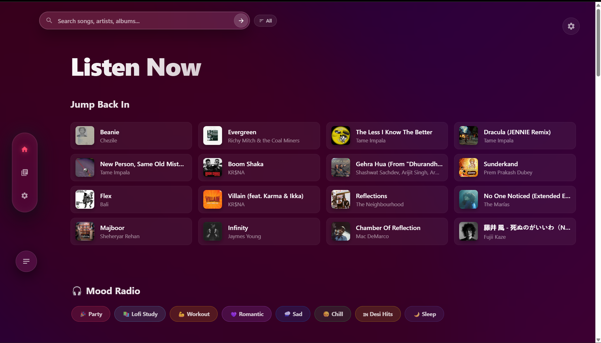
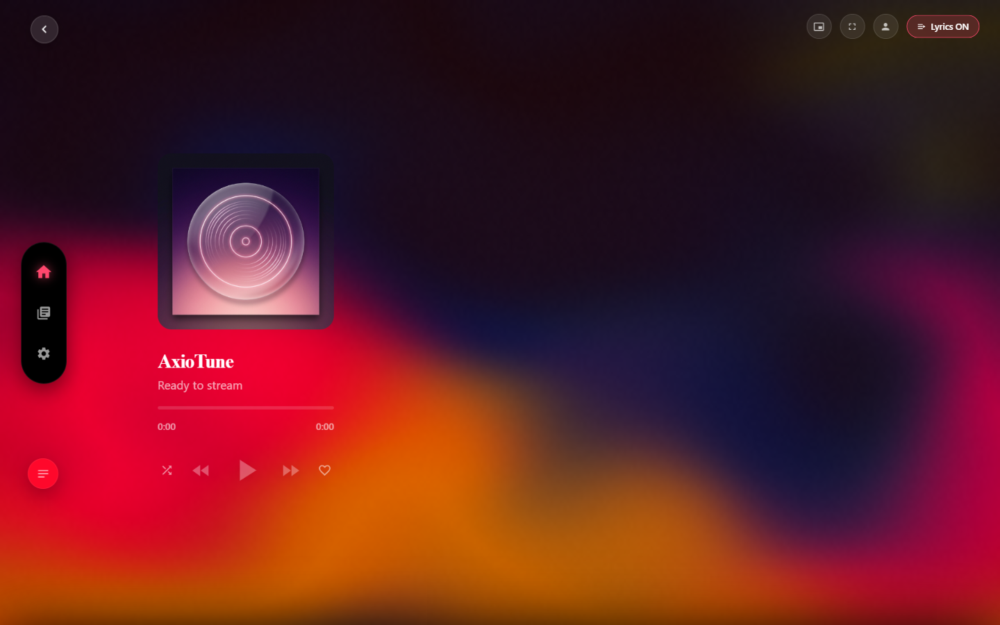
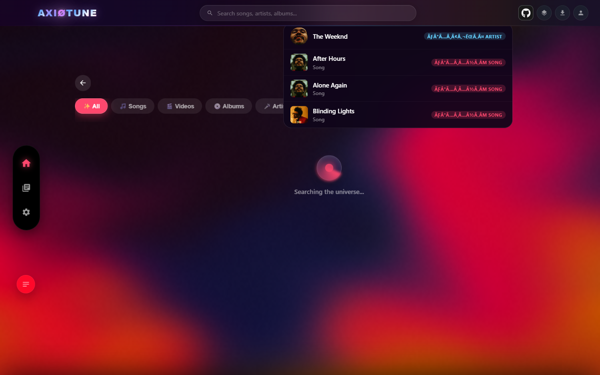
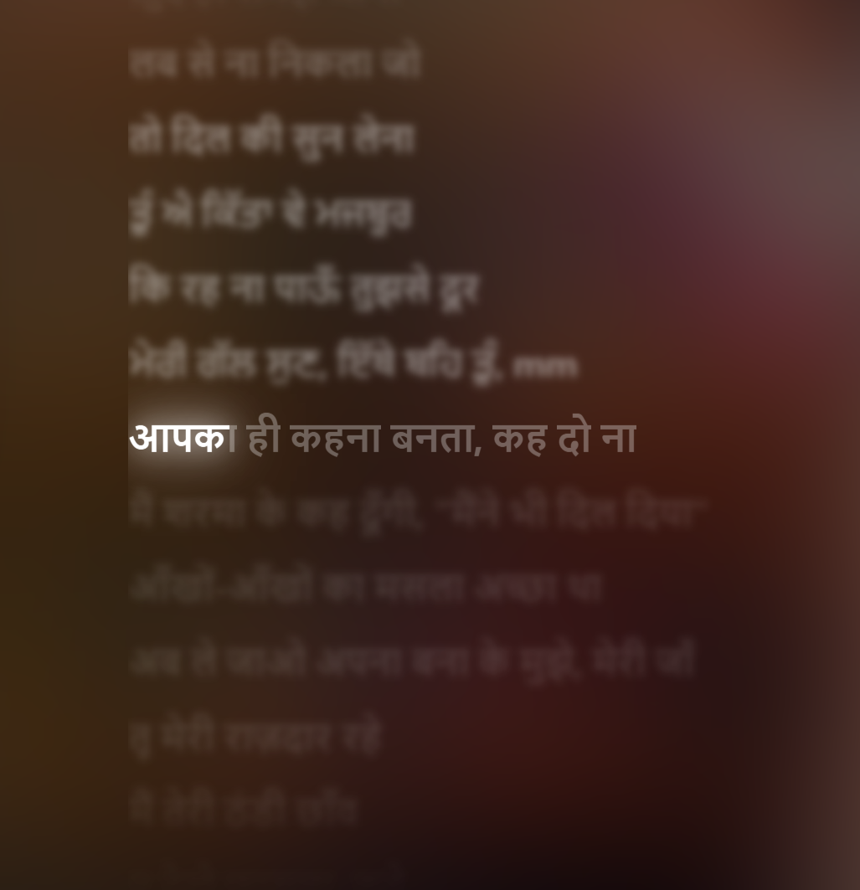

# 🎵 AxioTune https://axiotune.onrender.com

Welcome to **AxioTune**! This is a state-of-the-art, feature-rich, and visually stunning web-based music streaming application. Designed with a premium "Liquid Glass" aesthetic, it gives you the absolute best audio and visual experience possible.

With built-in 3D Spatial Audio, real-time synced lyrics, and native app installation support, AxioTune is built to rival top-tier streaming platforms.

### 🚀 Live Demo
**Try it out here:** [https://axiotune.onrender.com](hhttps://axiotune.onrender.com) *(Note: Render spins down inactive instances, so it might take 30-50 seconds to load initially)*

---

## ✨ Cutting-Edge Features

### 🎧 Next-Gen Audio Engine
- **Spatial Audio (3D Cinema):** A custom Web Audio API engine that widens the stereo field, adds a subtle Haas effect delay, and pumps up cinematic bass & treble for a "Concert Hall" experience.
- **8D Rotating Audio:** Listen to any track with mind-bending 8D panning that seamlessly rotates the audio around your head (Requires Headphones).
- **Zero-Lag Streaming:** Bypasses bot-blocks using a combination of fast Invidious API proxies and fallback streams, ensuring instant playback without the dreaded `0:00` errors.

### 🎨 Stunning Visual Themes
- **Dynamic Theme (Apple Music Style):** Real-time, 60fps animated, heavily blurred background that reacts to the current album cover.
- **Static Theme (YouTube Music Style):** A clean, vibrant mesh-gradient glow with a stylish vignette overlay. No messy blurs, just beautiful colors.
- **Pitch Black Mode:** True OLED-friendly deep black background for battery saving and night-time listening.

### 🥳 Party Mode (Listen Together)
- Generate a unique **Party Link** and share it with your friends. 
- Enjoy synchronized, real-time playback across multiple devices using the built-in WebSocket engine!

### 📱 Install as a Native App (PWA)
- Fully supports **Progressive Web App (PWA)** installation! 
- Install AxioTune directly to your Windows/Mac Desktop or Android/iOS Home Screen for a native, app-like experience without browser tabs.

### 🎤 Synced Lyrics & Discovery
- **Real-time Synced Lyrics:** Karaoke-style lyrics that scroll and highlight in sync with the track (Powered by LRCLIB).
- **Infinite Queue & Radio:** Auto-generated infinite radio playback when your queue ends.
- **Library & Search:** Fast searching with smart suggestions and a local library to save your favorite tracks.

---

## 📸 Screenshots

*(Upload your screenshots to a folder named `screenshots` in your GitHub repo, and they will appear here!)*

| Home Screen | Player View |
| :---: | :---: |
|  |  |

| Search & Suggestions | Synced Lyrics |
| :---: | :---: |
|  |  |

---

## 🛠️ Tech Stack

- **Frontend:** Vanilla HTML, CSS (Glassmorphism), JavaScript, Web Audio API
- **Backend:** Python (FastAPI), Uvicorn, WebSockets
- **APIs Used:** 
  - `ytmusicapi` (for rich metadata and search)
  - `yt-dlp` (for robust audio extraction)
  - `lrclib` (for time-synced lyrics)

---

## ⚙️ How to Run Locally

Running AxioTune on your own machine is super easy.

1. **Clone the repository:**
   ```bash
   git clone https://github.com/your-username/apple-music-clone.git
   cd apple-music-clone
   ```

2. **Install the dependencies:**
   ```bash
   pip install -r requirements.txt
   ```

3. **Start the Server:**
   - **Windows:** Just double-click the `start_server.bat` file! It will automatically start the server and open your browser.
   - **Mac/Linux:** Run `python backend.py` in your terminal.

4. **Open your browser (if not opened automatically):**
   Go to `http://localhost:10000` to enjoy the music!

---

*Made with ❤️ for music lovers.*
